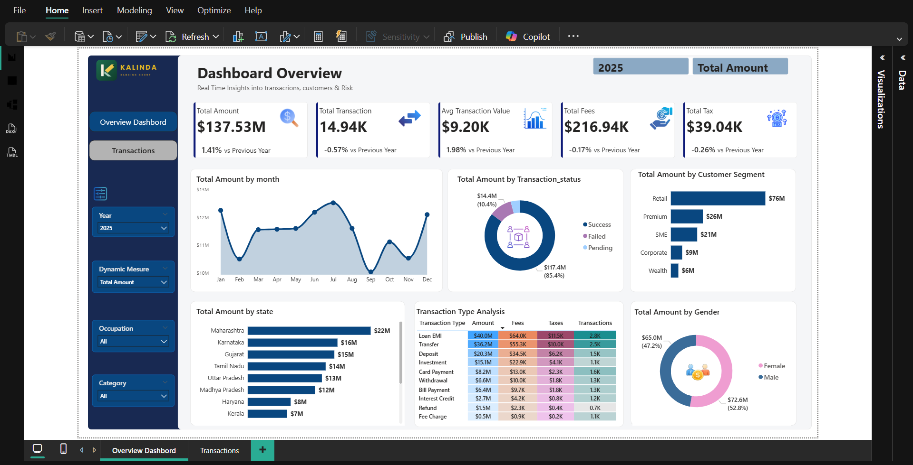
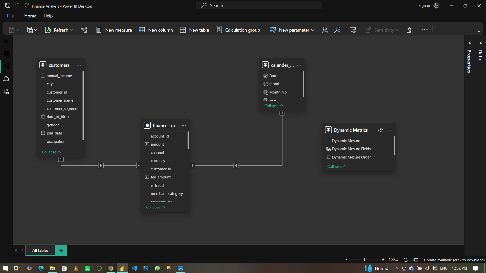

# 💰 Financial Analytics Dashboard | Power BI

## Overview

This project presents an interactive Power BI dashboard developed to analyze financial transactions, customer behavior, transaction performance, fees, taxes, and regional contributions.

The dashboard helps stakeholders monitor key financial KPIs, identify trends, and support data-driven decision-making.

---

## Business Objectives

- Monitor overall financial performance
- Analyze monthly transaction trends
- Track transaction success rates
- Identify top-performing customer segments
- Compare state-level performance
- Evaluate fees and tax revenue
- Understand customer demographics

---

## Key KPIs

- Total Amount
- Total Transactions
- Average Transaction Value
- Total Fees
- Total Tax
- Year-over-Year (YoY) Growth

---

## Dashboard Features

### Executive Overview
- Monthly Transaction Trend
- Transaction Status Analysis
- Customer Segment Analysis
- State Performance Analysis
- Gender Analysis
- Transaction Type Performance

### Transaction Details
- Drill-through analysis
- Detailed transaction records
- Interactive filtering

---

## Data Model

The solution follows a Star Schema design:

- **Fact Table:** Finance_Transactions
- **Dimensions:** Customers, Calendar
- **Parameter Table:** Dynamic Metrics

---

## Technologies Used

- Power BI
- DAX
- Power Query
- Data Modeling

---

## Dashboard Preview

### Executive Dashboard

### Data Model

---

## Business Impact

This dashboard enables management to:

- Monitor KPIs in real time
- Identify high-value customers
- Evaluate regional performance
- Improve financial decision-making

---

## Author

**Christian Mutia Kalinda**

Data Analyst | Power BI Developer

**Skills:** Power BI, SQL, DAX, Python, Data Visualization
